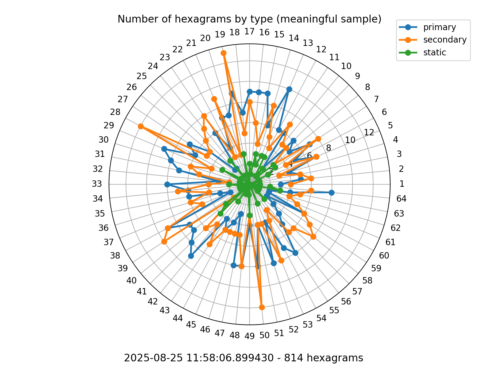

# I Ching Log

This is an experiment to understand whether I Ching's responses are completely random or there's something significant behind them.

The control sample consists in 100,000 consultations done with [`iching-cli`](https://github.com/cantaprete/iching-cli) and [this simple script](data/control_sample_gen.sh).

It resulted in 182,137 hexagrams. There are, of course, as many primary hexagrams as secondary (82,136), and 17,864 static hexagrams.  The differences between the number of changing hexagrams and the number of static ones can surely be explained mathematically.[^1]

When plotted, it's clear that the results are randomic:

I defined those as control samples because you're supposed to consult the I Ching with a meaningful question.  While the process uses a randomic technique, it's the meaning that should make the difference.

I'm in the process of logging all meaningful consultations of the I Ching, and here is the data plotted in the same way as the sample data:

Of course, right now I have too little data to get to a conclusion, but I expect one of these will happen:

1. The plots **won't show** a roughly random distribution between the three types of hexagrams.  Some hexagrams or areas will have more point then others.

2. The plots **will show** a roughly random distribution between the three types of hexagrams, but when taken in time-definied subset, some hexagrams or areas will have more point then others.  This could be explained by the fact that different times have a predominant share of different topic, so while the distribution of the whole set is random, the one of each subset is not.

3. The plots **will show** a roughly random distribution between the three types of hexagrams, either taken as a whole or by subsets.

## How I log my readings

Logging can be quite boring. To make it easier, I built an iOS shortcut (you can find it [here](Record%20response.shortcut)) that sends a JSON packet to Github.  [This workflow](.github/workflows/update_data.yml) does the rest.

[^1]: The I Ching can be consulted in different ways, but all of them ends up giving six lines. Each can either be moving or static. "Moving" means a line that starts as yang (solid, ⚊) and ends up yin (broken, ⚋) or viceversa, while a static lines doesn't change. If you have moving lines, you end up with two hexagrams: a primary with every line before they changed, and a secondary with them changed.
