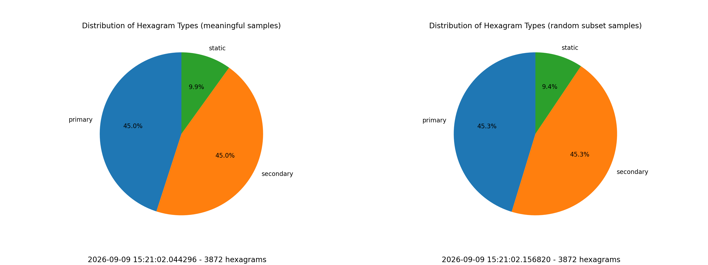
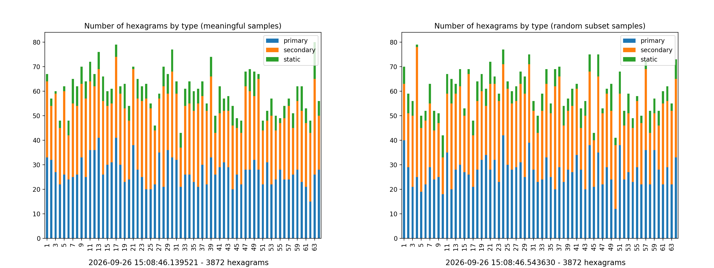
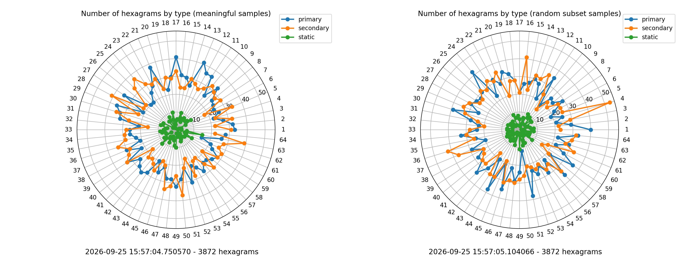
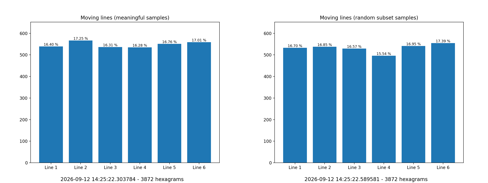
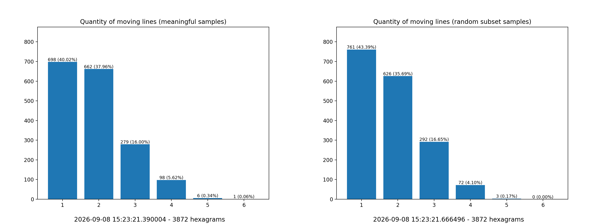

# Same size comparison

While the full random sample clearly shows the uniformity of the results, a comparison between charts with the same number of records might be useful.  The random subset shows the first $n$ records, where $n$ is the size of the meaningful set.

